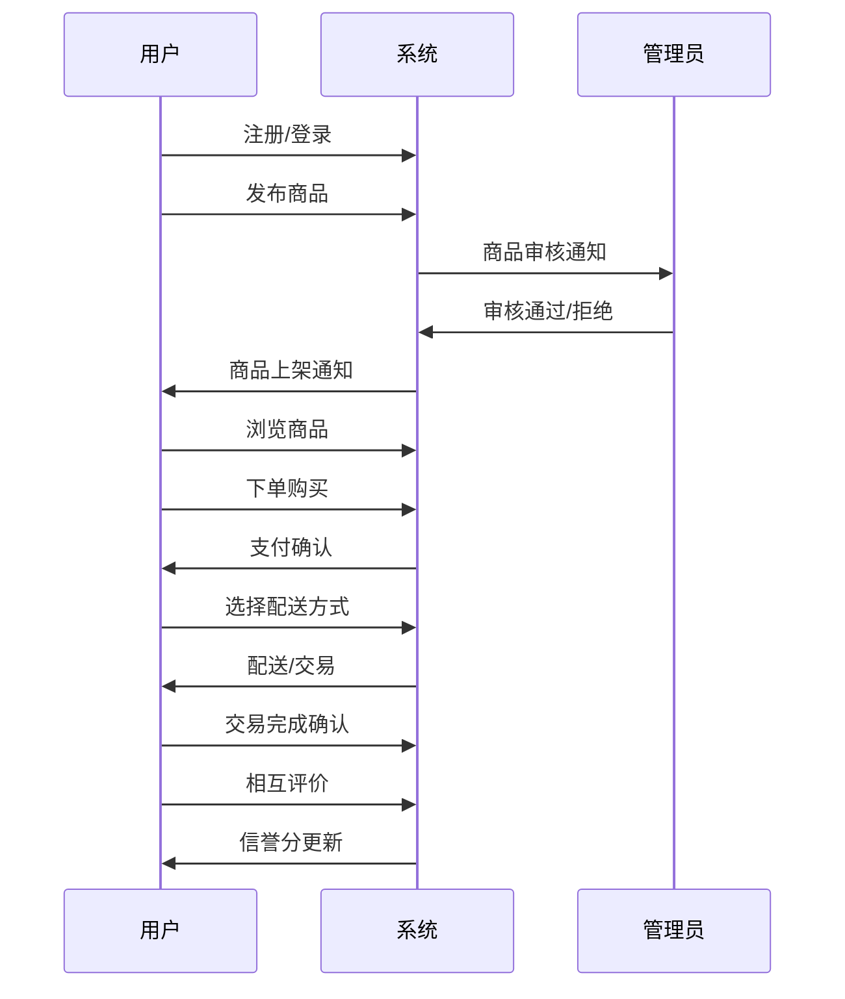
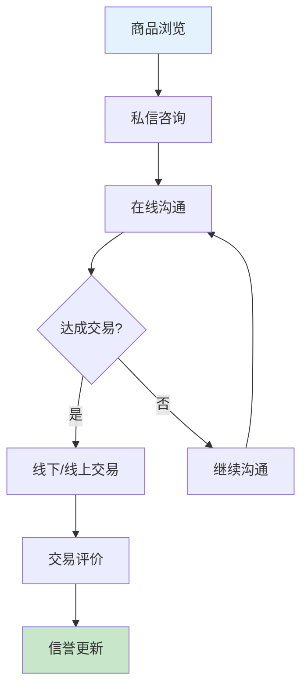
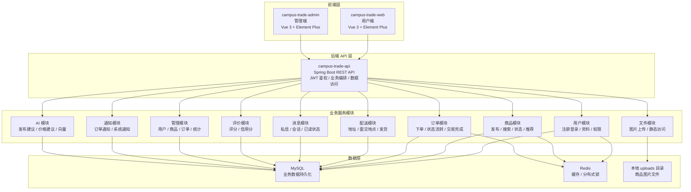
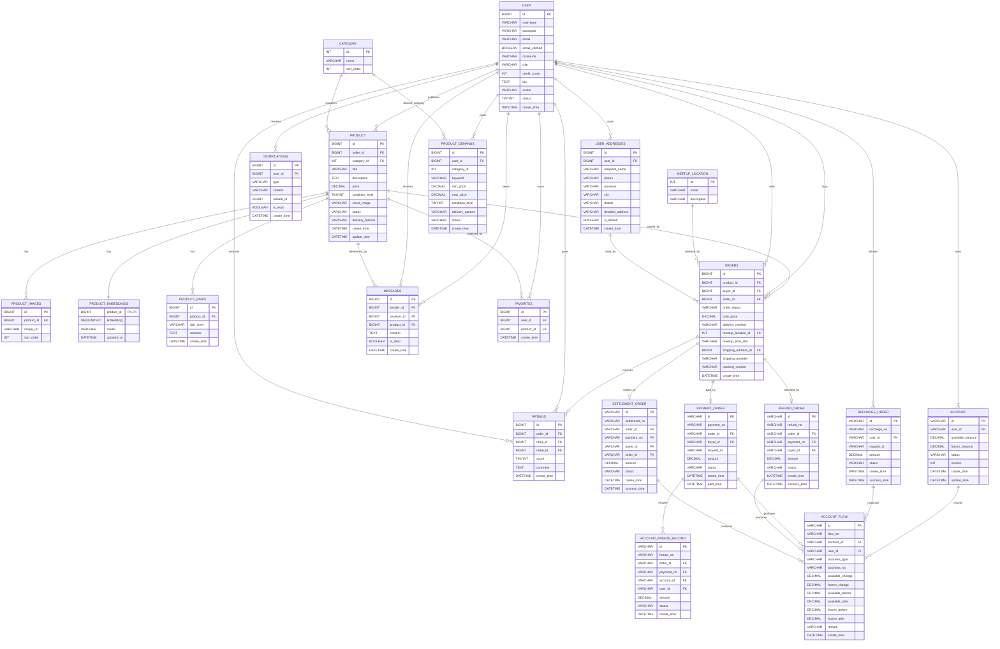

# GreenLoop 可信交易与资金清结算平台 · 系统架构设计文档

## 一、系统描述

### 1.1 系统概述

**GreenLoop——可信交易与资金清结算平台**是一个面向个人、组织与园区场景的全栈 Web 应用，由校园二手交易场景演进而来。系统采用前后端分离架构，以**模拟银行核心清结算逻辑**为目标，支持商品发布与浏览、下单、模拟支付与资金冻结、履约结算、退款回滚、账户流水、私信沟通与后台运营，并围绕一致性、幂等性、安全性、可审计性构建交易闭环。

### 1.2 核心业务场景

- **商品交易**：用户可以发布二手/闲置商品（书籍、电子产品、生活用品等），其他用户可以浏览、搜索、购买
- **交易履约**：支持线下面交与快递配送两种方式
- **模拟支付与资金托管**：下单后冻结买家资金，确认收货后结算给卖家，取消时原路退款（阶段二已落地）
- **账户与流水**：虚拟账户双层余额（可用/冻结）+ 追加式不可变资金流水，支持资金守恒追溯
- **用户互动**：私信聊天、商品收藏、用户评价
- **信誉体系**：基于交易评价建立用户信誉评分
- **风控（规划中，未实现，不作为当前卖点）**：商品敏感词、黑名单、大额 / 高频交易等规则引擎与三级决策，阶段三已设计、暂缓实现，详见第七章演进方向
- **管理运营**：管理员可管理用户、商品、订单、配送、地点、统计，并对资金流水做只读查询

### 1.3 技术特点

- **前后端分离**：Vue 3 + Spring Boot 架构
- **安全认证**：JWT + Spring Security 实现权限控制
- **数据缓存**：Redis 缓存热点数据提升性能
- **文件存储**：支持多图片上传和预览
- **实时通信**：私信系统支持用户间实时沟通
- **智能推荐**：基于协同过滤的商品推荐算法

### 1.4 用户角色

- **普通用户（USER）**：可以发布商品、购买商品、管理订单、使用私信等
- **管理员（ADMIN）**：可以管理用户、商品、订单，查看统计数据，进行平台运营

### 1.5 核心设计原则（银行系统 DNA）

项目以金融科技系统为建设目标，围绕四条原则设计交易闭环：

| 原则 | 当前落地情况 |
| --- | --- |
| **一致性** | 订单状态机严格、事务封闭（核心资金操作同一本地事务内完成）、虚拟账户资金守恒（可用+冻结快照、DB 层 `CHECK(after>=0)`） |
| **幂等性** | 充值/支付通过 `request_id` + 用户唯一约束防重复扣款/退款；一个订单仅对应一笔支付单（行锁 + 状态条件更新）；30 分钟未支付订单超时关闭防并发冲突 |
| **安全性** | RBAC（`@PreAuthorize` 区分 ADMIN/普通用户）、BCrypt 密码哈希、JWT 无状态鉴权；字段级 AES 加密与接口脱敏为阶段四（P4）待增强项 |
| **可审计性** | 资金流水 `account_flow` 采用追加式、不可变记录，已实现全链路余额快照追溯；后台关键操作审计日志（`operation_audit_log`）列为阶段四（P1）规划，尚未实现 |

## 二、系统功能模块图

### 2.1 整体功能架构

```mermaid
graph TB
    A[校园交易平台] --> B[用户端功能模块]
    A --> C[管理端功能模块]
    
    B --> D[用户管理模块]
    B --> E[商品管理模块]
    B --> F[交易管理模块]
    B --> G[配送管理模块]
    B --> H[社交功能模块]
    B --> I[通知系统模块]
    
    D --> D1[用户注册/登录]
    D --> D2[个人信息管理]
    D --> D3[头像上传]
    D --> D4[信誉分管理]
    
    E --> E1[商品发布]
    E --> E2[商品浏览/搜索]
    E --> E3[商品详情查看]
    E --> E4[商品编辑/删除]
    E --> E5[商品收藏]
    
    F --> F1[订单创建]
    F --> F2[订单状态管理]
    F --> F3[支付确认]
    F --> F4[交易完成]
    
    G --> G1[校园线下交易]
    G --> G2[快递配送]
    G --> G3[收货地址管理]
    G --> G4[物流跟踪]
    
    H --> H1[私信聊天]
    H --> H2[用户评价]
    H --> H3[信誉评分]
    H --> H4[智能推荐]
    
    I --> I1[系统通知]
    I --> I2[订单通知]
    I --> I3[消息推送]
    
    C --> J[用户管理模块]
    C --> K[商品管理模块]
    C --> L[订单管理模块]
    C --> M[运营管理模块]
    C --> N[系统配置模块]
    
    J --> J1[用户列表查看]
    J --> J2[用户状态管理]
    J --> J3[用户信息编辑]
    J --> J4[信誉分调整]
    
    K --> K1[商品列表管理]
    K --> K2[商品状态控制]
    K --> K3[商品审核]
    K --> K4[商品统计]
    
    L --> L1[订单列表查看]
    L --> L2[订单状态跟踪]
    L --> L3[配送管理]
    L --> L4[订单统计]
    
    M --> M1[数据统计面板]
    M --> M2[用户增长分析]
    M --> M3[交易数据分析]
    M --> M4[系统监控]
    
    N --> N1[交易地点管理]
    N --> N2[商品分类管理]
    N --> N3[系统参数配置]
    N --> N4[数据导出]
```

### 2.2 核心业务流程

#### 2.2.1 商品交易流程

#### 2.2.2 订单管理流程

#### 2.2.3 用户互动流程

## 三、模块边界与微服务拆分（规划）

### 3.1 模块边界划分

基于业务领域和功能职责，系统可从业务边界上划分为以下服务模块。当前代码以单体 Spring Boot 应用承载这些模块，通过 Controller、Service、Mapper 分层实现业务隔离；文档中的“服务”主要用于说明职责边界和模块划分。

#### 3.1.1 用户服务 (User Service)
**职责**：用户注册、登录、认证、个人信息管理
- 用户注册/登录
- JWT Token 生成和验证
- 用户信息CRUD操作
- 用户状态管理
- 权限验证

#### 3.1.2 商品服务 (Product Service)
**职责**：商品管理、分类管理、搜索推荐
- 商品发布/编辑/删除
- 商品分类管理
- 商品搜索和筛选
- 商品推荐算法
- 商品状态管理

#### 3.1.3 订单服务 (Order Service)
**职责**：订单管理、交易流程控制
- 订单创建和状态管理
- 订单支付处理
- 订单状态流转
- 订单查询和统计
- 交易完成确认

#### 3.1.4 配送服务 (Delivery Service)
**职责**：物流配送、地址管理
- 收货地址管理
- 配送方式选择
- 物流信息跟踪
- 校园交易地点管理
- 配送状态更新

#### 3.1.5 消息服务 (Message Service)
**职责**：用户间通信、通知推送
- 私信聊天功能
- 系统通知推送
- 消息存储和查询
- 实时消息推送
- 消息状态管理

#### 3.1.6 评价服务 (Rating Service)
**职责**：用户评价、信誉管理
- 交易评价功能
- 信誉分计算
- 评价统计和分析
- 信誉分更新
- 评价查询

#### 3.1.7 文件服务 (File Service)
**职责**：文件上传、存储、访问
- 图片上传处理
- 文件存储管理
- 文件访问控制
- 图片压缩和优化
- 文件删除和清理

#### 3.1.8 管理服务 (Admin Service)
**职责**：后台管理、数据统计
- 用户管理功能
- 商品管理功能
- 订单管理功能
- 数据统计分析
- 系统配置管理

### 3.2 模块划分架构图

## 四、数据库 ER 图与表关系说明

### 4.1 ER 图

以下 ER 图基于 `campus-trade-api/src/main/resources/campus_trade.sql` 中的当前表结构整理，展示用户、商品、订单、评价、消息、收藏、通知、地址、交易地点、商品图片、商品向量、风控记录和求购需求之间的主要关系。

### 4.2 表关系说明

- `user` 是用户中心表，普通用户和管理员都存储在该表中，通过 `role` 区分身份，通过 `status` 控制是否可用。
- `product` 是商品主表，每个商品必须关联一个卖家 `seller_id` 和一个分类 `category_id`。一个用户可以发布多个商品，一个分类下可以有多个商品。
- `product_images` 保存商品多图，和 `product` 是一对多关系；`product.cover_image` 保存封面图，便于列表页快速展示。
- `product_embeddings` 保存商品向量，一个商品最多对应一条向量记录，用于语义搜索和混合推荐。
- `product_risks` 保存商品风控检测记录，一个商品可以有多条风控记录，用于保留不同时间的检测结果。
- `orders` 是交易主表，每笔订单关联一个商品、一个买家和一个卖家。买家和卖家都来自 `user` 表，商品来自 `product` 表。
- `orders.meetup_location_id` 关联 `meetup_location`，用于线下面交订单；`orders.shipping_address_id` 关联 `user_addresses`，用于快递配送订单。
- `ratings` 是评价表，每条评价关联一笔订单、一个评价人和一个被评价人。`uk_order_rater` 保证同一订单中同一评价人只能评价一次。
- `messages` 是站内私信表，发送方和接收方都关联 `user`，可选关联 `product`，用于围绕某个商品进行咨询。
- `favorites` 是用户收藏表，连接 `user` 和 `product`，`uk_user_product` 保证同一用户不能重复收藏同一商品。
- `notifications` 保存站内通知，每条通知属于一个用户，`related_id` 用于记录关联订单或商品等业务对象。
- `user_addresses` 保存用户收货地址，一个用户可以维护多个地址，快递订单可引用其中一个地址。
- `meetup_location` 保存平台推荐的校园线下交易地点，由管理端维护，普通用户下单时选择。
- `product_demands` 保存用户求购需求，必须关联发布用户；其中 `category_id` 在业务上对应商品分类，当前 SQL 中未显式声明外键。

### 4.3 资金账户与流水（核心实现）

以下表为模拟支付与清结算所用，属于当前实现，非后续规划。其字段定义、状态枚举、幂等设计与资金守恒约束的**权威说明见《开发基准》§七.5 虚拟账户与资金单据状态**；ER 图（已包含这些表）见上图 4.1。

- `account`：虚拟账户，可用 / 冻结双层余额 + 乐观锁 `version`
- `account_flow`：不可变资金流水，记录变动前后余额快照，支持全链路追溯
- `recharge_order` / `payment_order` / `account_freeze_record` / `refund_order` / `settlement_order`：充值、支付、冻结、退款、结算五类单据，通过 `request_id` 唯一约束与状态条件更新实现幂等

资金链路：下单 → 支付冻结（可用转冻结）→ 确认收货结算（冻结释放并转入卖家可用）→ 取消则退款（冻结释放并回到买家可用）。所有金额字段为 `DECIMAL(18,2)`。

## 五、技术选型与理由

本章只描述当前项目已经实际使用的技术栈，未落地的网关、注册中心、消息队列、搜索引擎、对象存储和容器编排等内容统一放在第七章“后续改进方向”中说明。

| 技术 | 当前用途 | 选择理由 |
| --- | --- | --- |
| Spring Boot 2.7.18 | 后端 REST API 应用框架 | 项目以业务接口和数据管理为核心，Spring Boot 能快速搭建稳定的 Web API，并与安全、缓存、数据访问等组件自然集成。 |
| Spring Security | 接口认证与访问控制 | 系统区分普通用户和管理员，需要统一的认证过滤器、接口保护和角色权限控制。 |
| JWT | 登录令牌与无状态鉴权 | 用户端和管理端都是前后端分离应用，JWT 便于前端保存登录态并在请求中携带身份信息，后端无需维护 Session。 |
| MyBatis | 持久层访问 | 项目表关系和业务 SQL 较直观，MyBatis 便于精确控制查询、分页、关联字段映射和后台筛选逻辑。 |
| MySQL 8.x | 核心业务数据库 | 用户、商品、订单、评价、收藏等数据具有明显关系结构，MySQL 适合事务处理、外键约束和关联查询。 |
| Redis | 缓存与分布式协调中间件 | 分类、商品、订单等热点数据通过缓存减少数据库压力；同时为多实例订单过期扫描提供锁的存储与协调。 |
| Spring Cache | 缓存抽象与防护策略 | 通过注解接入缓存，并在统一前缀、分级 TTL 的基础上实现 TTL ±20% 随机抖动和空值短 TTL，降低缓存雪崩与穿透风险。 |
| Redisson 3.27.2 | 分布式锁客户端 | 订单支付超时扫描使用非阻塞分布式锁，保证多实例同一周期仅一个执行者；watch dog 在持锁期间自动续期，实例异常后可自动接管。 |
| RabbitMQ + Transactional Outbox（可选） | 通知异步投递 | 默认关闭；开启后交易事务以 Outbox 持久化通知事件，发布器异步投递、消费者幂等写通知，失败重试后进入死信状态，避免通知故障回滚资金主链路。 |
| PageHelper | 分页插件 | 商品列表、用户管理、订单管理等页面需要分页查询，PageHelper 与 MyBatis 集成简单。 |
| Spring Mail | 邮箱验证码 | 注册和账号相关能力需要邮件发送支持，Spring Mail 可直接对接 SMTP 服务。 |
| 本地 `uploads` 目录 | 商品图片存储 | 当前演示和本地部署场景下，本地文件目录实现简单，能满足图片上传、预览和静态访问需求。 |
| Vue 3 | 用户端和管理端前端框架 | Vue 3 组件化能力强，适合构建商品流、个人中心、聊天页和后台管理页面。 |
| Vite | 前端构建工具 | Vite 启动快、配置轻，适合前端开发调试和打包。 |
| Vue Router | 前端路由 | 用户端和管理端均包含多页面视图，需要路由跳转、嵌套路由和登录守卫。 |
| Pinia | 前端状态管理 | 用于保存用户登录态、Token、角色等跨页面状态，API 简洁，适合 Vue 3 项目。 |
| Element Plus | UI 组件库 | 表单、表格、分页、弹窗、消息提示等组件覆盖用户端和管理端常见交互，能提升开发效率和界面一致性。 |
| ECharts | 管理端数据可视化 | 管理后台需要展示统计数据、用户增长、订单趋势等图表，ECharts 能满足常见运营分析展示。 |
| Maven | 后端依赖和构建管理 | Spring Boot 项目标准构建工具，便于统一管理依赖、测试和打包流程。 |
| Dockerfile | 后端容器化打包基础 | 当前后端已提供 Dockerfile，可作为后续部署和环境迁移的基础。 |
| 虚拟账户 + 追加式资金流水 | 模拟支付/托管/结算与账务一致 | 借鉴银行核心账户与会计核算思路：可用/冻结双层余额 + 乐观锁，资金变动以不可变流水记录前后快照，保证一致性、幂等性与可追溯（阶段二已落地）。 |

## 六、总结

GreenLoop 当前采用前后端分离架构，由用户端 `campus-trade-web`、管理端 `campus-trade-admin` 和后端 API `campus-trade-api` 组成。后端以 Spring Boot 单体应用承载用户、商品、订单、配送、消息、通知、评价、文件、AI、虚拟账户与资金流水和管理端等业务模块，并通过 MySQL 保存核心业务数据，通过 Redis 提升热点数据访问性能、协调订单过期扫描的多实例执行。

从业务完整性看，系统已经覆盖可信交易的主要流程：用户注册登录、商品发布与浏览、私信沟通、收藏、下单、模拟支付与资金冻结、线下面交或快递配送、确认收货结算/取消退款、评价信用分更新，以及管理端对用户、商品、订单、配送、地点、统计与资金流水的管理。

从架构完整性看，当前实现更接近“模块化单体 + 双前端”的形态。第三章的服务拆分描述用于明确业务边界，为后续真正拆分微服务提供依据；第四章的 ER 图说明了核心数据模型；第五章说明了当前已经落地的技术选型。

## 七、后续改进方向

当前项目已经具备较完整的业务闭环，但以下能力尚未完整落地，可作为后续演进方向。

### 7.1 微服务基础设施

- **Spring Cloud Gateway**：作为统一 API 网关，集中处理路由、认证、跨域、限流和灰度发布。
- **Nacos**：作为服务注册发现和配置中心，支持多服务动态发现、配置集中管理和多环境配置隔离。
- **Sentinel**：用于接口限流、熔断降级和服务保护，降低高并发或异常调用对核心链路的影响。
- **OpenFeign / Spring Cloud LoadBalancer**：用于微服务之间的声明式 HTTP 调用和负载均衡。

### 7.2 数据与一致性能力

- **Seata**：在订单、商品、配送、评价等服务真正拆分后，用于处理跨服务事务或补偿流程。
- **RabbitMQ**：用于订单通知、消息推送、商品状态变更、AI 向量重建等异步任务，降低主流程响应时间。
- **Elasticsearch**：用于商品全文搜索、复杂筛选、搜索建议和运营统计聚合，提升搜索体验。
- **MinIO**：替代本地 `uploads` 目录，作为对象存储统一管理商品图片、头像和导出文件。
- **Redis Cluster**：从单实例缓存升级为高可用缓存集群，提升缓存容量和容错能力。
- **MySQL 主从复制 / ShardingSphere**：在数据量增长后支持读写分离、分库分表和更强的数据扩展能力。

### 7.3 运维与部署能力

- **Spring Boot Actuator**：暴露健康检查和运行指标，便于部署平台判断服务状态。
- **Prometheus + Grafana + Micrometer**：采集和展示接口延迟、错误率、JVM、数据库连接池和业务指标。
- **ELK Stack**：集中采集和检索应用日志，便于排查多服务环境下的问题。
- **Docker Compose / Kubernetes**：统一编排后端、前端、数据库、缓存和其他中间件，支持多环境部署。
- **CI/CD 流水线**：实现代码提交后的自动构建、测试、镜像打包、部署和回滚。

### 7.4 业务能力完善

当前交易闭环已包含**模拟**支付、冻结、结算与退款（阶段二），以下为可继续演进的方向：

- **真实支付渠道接入**：在现有模拟资金体系之上接入真实支付平台，完善支付状态、支付回调与对账流程（不改变既有账户/流水模型）。
- **风控引擎（阶段三，设计完成暂缓实现）**：商品敏感词审核、用户黑名单硬拦截、大额/高频交易人工审核等规则，三级决策（PASS/REVIEW/REJECT）+ 四级风险等级，资金保全策略（中风险先冻结后审核）。
- **操作审计闭环（阶段四 P1，规划中）**：后台强制取消、账户冻结/解冻、权限变更等写入追加式 `operation_audit_log`，记录操作者、角色、IP、单号、前后快照与 traceId。
- **物流实时追踪**：接入第三方物流查询接口，展示快递轨迹。
- **校园/组织身份认证**：接入学校邮箱、学号或组织账号认证，增强交易可信度。
- **举报、投诉和申诉**：补充商品举报、用户投诉、平台审核和申诉处理流程。
- **信用分变化历史**：记录每次评价或违规导致的信用分变化，便于用户和管理员追踪。
- **多组织/多区域运营**：增加组织、区域等维度，支持平台扩展到多个园区。
- **字段加密与接口脱敏（阶段四 P4）**：phone/email 等敏感字段 AES 加密存储、接口返回脱敏。
