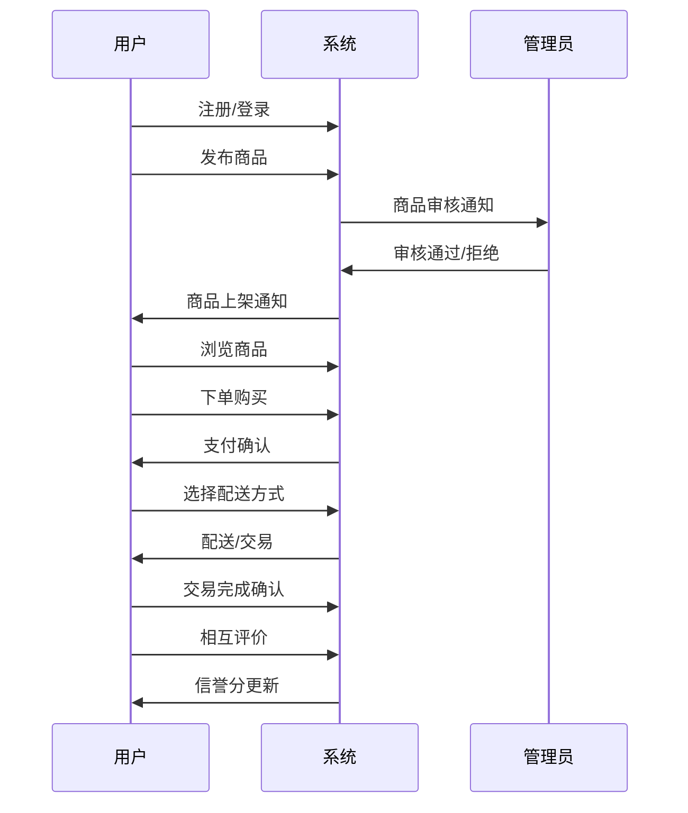
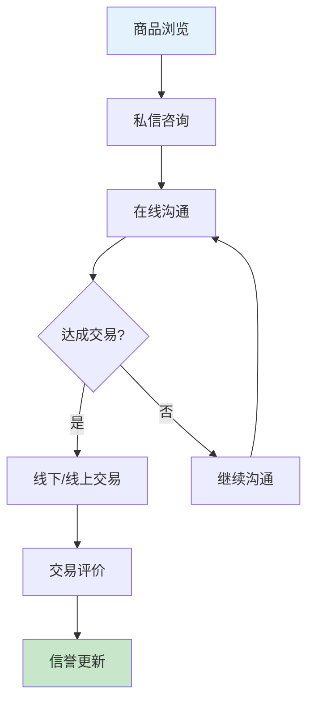
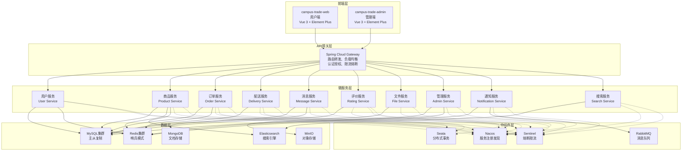
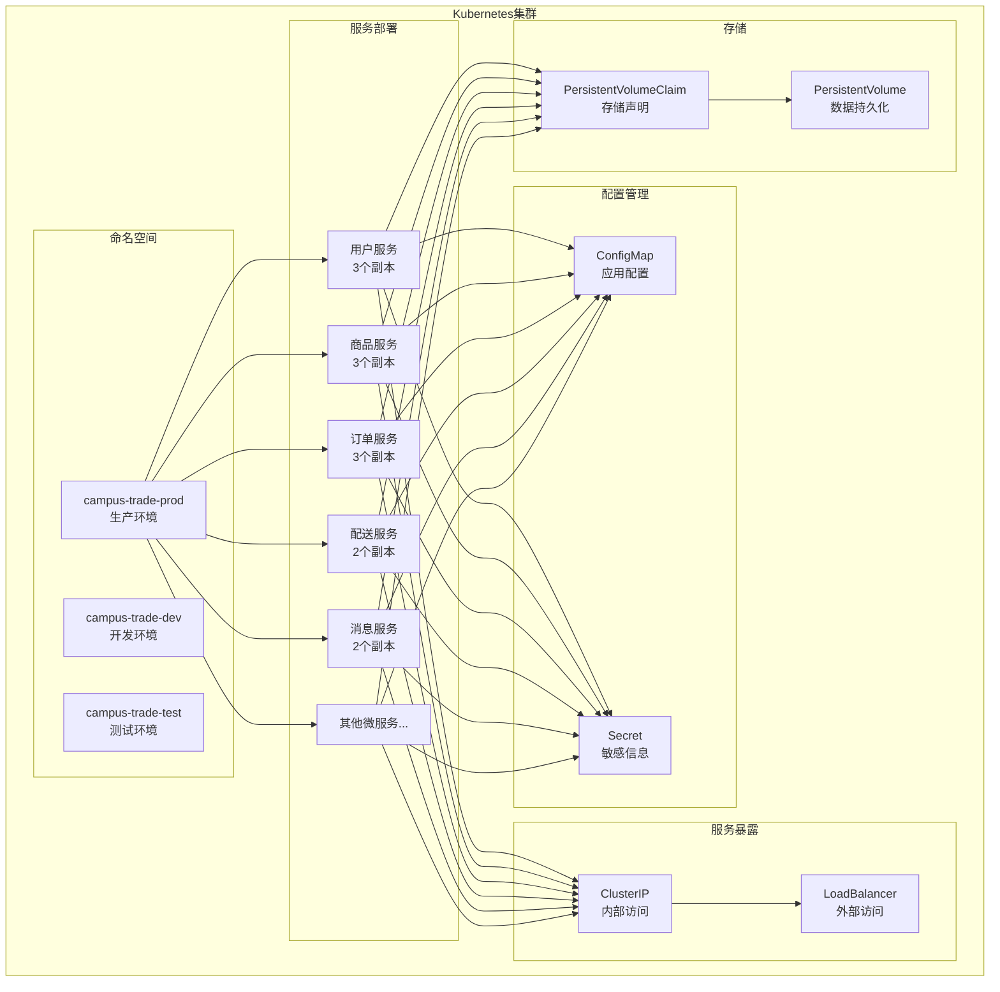
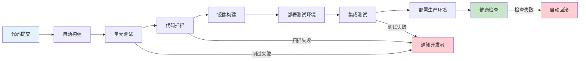

# 校园交易平台微服务架构设计文档

## 一、系统描述

### 1.1 系统概述

**2Hand - 又又校园二手交流平台**是一个专为大学生设计的全栈Web应用，旨在为校园内学生提供一个安全、便捷、智能的二手物品在线交易社区。系统采用前后端分离架构，支持用户发布商品、浏览购买、在线沟通、订单管理等完整的电商交易流程。

### 1.2 核心业务场景

- **商品交易**：学生可以发布二手商品（书籍、电子产品、生活用品等），其他学生可以浏览、搜索、购买
- **校园配送**：支持校园内线下交易和快递配送两种方式
- **用户互动**：提供私信聊天、商品收藏、用户评价等社交功能
- **信誉体系**：基于交易评价建立用户信誉评分系统
- **管理运营**：管理员可以管理用户、商品、订单，进行数据统计分析

### 1.3 技术特点

- **前后端分离**：Vue 3 + Spring Boot 架构
- **安全认证**：JWT + Spring Security 实现权限控制
- **数据缓存**：Redis 缓存热点数据提升性能
- **文件存储**：支持多图片上传和预览
- **实时通信**：私信系统支持用户间实时沟通
- **智能推荐**：基于协同过滤的商品推荐算法

### 1.4 用户角色

- **普通用户（USER）**：可以发布商品、购买商品、管理订单、使用私信等
- **管理员（ADMIN）**：可以管理用户、商品、订单，查看统计数据，进行平台运营

## 二、系统功能模块图

### 2.1 整体功能架构

```mermaid
graph TB
    A[校园交易平台] --> B[用户端功能模块]
    A --> C[管理端功能模块]
    
    B --> D[用户管理模块]
    B --> E[商品管理模块]
    B --> F[交易管理模块]
    B --> G[配送管理模块]
    B --> H[社交功能模块]
    B --> I[通知系统模块]
    
    D --> D1[用户注册/登录]
    D --> D2[个人信息管理]
    D --> D3[头像上传]
    D --> D4[信誉分管理]
    
    E --> E1[商品发布]
    E --> E2[商品浏览/搜索]
    E --> E3[商品详情查看]
    E --> E4[商品编辑/删除]
    E --> E5[商品收藏]
    
    F --> F1[订单创建]
    F --> F2[订单状态管理]
    F --> F3[支付确认]
    F --> F4[交易完成]
    
    G --> G1[校园线下交易]
    G --> G2[快递配送]
    G --> G3[收货地址管理]
    G --> G4[物流跟踪]
    
    H --> H1[私信聊天]
    H --> H2[用户评价]
    H --> H3[信誉评分]
    H --> H4[智能推荐]
    
    I --> I1[系统通知]
    I --> I2[订单通知]
    I --> I3[消息推送]
    
    C --> J[用户管理模块]
    C --> K[商品管理模块]
    C --> L[订单管理模块]
    C --> M[运营管理模块]
    C --> N[系统配置模块]
    
    J --> J1[用户列表查看]
    J --> J2[用户状态管理]
    J --> J3[用户信息编辑]
    J --> J4[信誉分调整]
    
    K --> K1[商品列表管理]
    K --> K2[商品状态控制]
    K --> K3[商品审核]
    K --> K4[商品统计]
    
    L --> L1[订单列表查看]
    L --> L2[订单状态跟踪]
    L --> L3[配送管理]
    L --> L4[订单统计]
    
    M --> M1[数据统计面板]
    M --> M2[用户增长分析]
    M --> M3[交易数据分析]
    M --> M4[系统监控]
    
    N --> N1[交易地点管理]
    N --> N2[商品分类管理]
    N --> N3[系统参数配置]
    N --> N4[数据导出]
```

### 2.2 核心业务流程

#### 2.2.1 商品交易流程

#### 2.2.2 订单管理流程

#### 2.2.3 用户互动流程

## 三、微服务架构设计

### 3.1 微服务拆分策略

基于业务领域和功能职责，将单体应用拆分为以下微服务：

#### 3.1.1 用户服务 (User Service)
**职责**：用户注册、登录、认证、个人信息管理
- 用户注册/登录
- JWT Token 生成和验证
- 用户信息CRUD操作
- 用户状态管理
- 权限验证

#### 3.1.2 商品服务 (Product Service)
**职责**：商品管理、分类管理、搜索推荐
- 商品发布/编辑/删除
- 商品分类管理
- 商品搜索和筛选
- 商品推荐算法
- 商品状态管理

#### 3.1.3 订单服务 (Order Service)
**职责**：订单管理、交易流程控制
- 订单创建和状态管理
- 订单支付处理
- 订单状态流转
- 订单查询和统计
- 交易完成确认

#### 3.1.4 配送服务 (Delivery Service)
**职责**：物流配送、地址管理
- 收货地址管理
- 配送方式选择
- 物流信息跟踪
- 校园交易地点管理
- 配送状态更新

#### 3.1.5 消息服务 (Message Service)
**职责**：用户间通信、通知推送
- 私信聊天功能
- 系统通知推送
- 消息存储和查询
- 实时消息推送
- 消息状态管理

#### 3.1.6 评价服务 (Rating Service)
**职责**：用户评价、信誉管理
- 交易评价功能
- 信誉分计算
- 评价统计和分析
- 信誉分更新
- 评价查询

#### 3.1.7 文件服务 (File Service)
**职责**：文件上传、存储、访问
- 图片上传处理
- 文件存储管理
- 文件访问控制
- 图片压缩和优化
- 文件删除和清理

#### 3.1.8 管理服务 (Admin Service)
**职责**：后台管理、数据统计
- 用户管理功能
- 商品管理功能
- 订单管理功能
- 数据统计分析
- 系统配置管理

### 3.2 微服务架构图

### 3.3 开源技术栈选择

#### 3.3.1 微服务框架
**Spring Cloud 2023.0.x**
- **选择理由**：
  - 与现有Spring Boot技术栈完美兼容
  - 提供完整的微服务解决方案
  - 社区活跃，文档完善
  - 支持服务发现、配置管理、熔断器等核心功能

#### 3.3.2 API网关
**Spring Cloud Gateway**
- **选择理由**：
  - 基于Spring WebFlux，性能优异
  - 支持动态路由配置
  - 内置限流、熔断、重试机制
  - 与Spring Cloud生态无缝集成

#### 3.3.3 服务注册与发现
**Nacos**
- **选择理由**：
  - 支持服务注册发现和配置管理
  - 提供健康检查和故障转移
  - 支持多环境配置管理
  - 相比Eureka更轻量，功能更丰富

#### 3.3.4 配置中心
**Nacos Config**
- **选择理由**：
  - 与Nacos服务发现统一管理
  - 支持配置热更新
  - 提供配置版本管理和回滚
  - 支持多环境配置隔离

#### 3.3.5 服务熔断与限流
**Sentinel**
- **选择理由**：
  - 阿里巴巴开源，生产环境验证
  - 支持流量控制、熔断降级、系统负载保护
  - 提供实时监控和控制台
  - 与Spring Cloud Gateway集成良好

#### 3.3.6 分布式事务
**Seata**
- **选择理由**：
  - 支持AT、TCC、SAGA、XA事务模式
  - 与Spring Cloud集成简单
  - 提供事务管理和监控
  - 适合电商场景的分布式事务需求

#### 3.3.7 消息队列
**RabbitMQ**
- **选择理由**：
  - 成熟稳定，社区活跃
  - 支持多种消息模式
  - 提供管理界面和监控
  - 适合异步消息处理和事件驱动架构

#### 3.3.8 搜索引擎
**Elasticsearch**
- **选择理由**：
  - 强大的全文搜索能力
  - 支持复杂查询和聚合分析
  - 提供实时搜索和自动补全
  - 适合商品搜索和推荐场景

#### 3.3.9 缓存中间件
**Redis Cluster**
- **选择理由**：
  - 高性能内存数据库
  - 支持多种数据结构
  - 提供集群模式保证高可用
  - 适合缓存、会话存储、计数器等场景

#### 3.3.10 数据库
**MySQL 8.0 + ShardingSphere**
- **选择理由**：
  - MySQL成熟稳定，生态完善
  - ShardingSphere提供分库分表能力
  - 支持读写分离和分布式事务
  - 适合关系型数据存储

#### 3.3.11 对象存储
**MinIO**
- **选择理由**：
  - 兼容Amazon S3 API
  - 支持分布式部署
  - 提供Web管理界面
  - 适合图片、文件等静态资源存储

#### 3.3.12 监控体系
**Prometheus + Grafana + Micrometer**
- **选择理由**：
  - Prometheus提供指标收集和告警
  - Grafana提供可视化监控面板
  - Micrometer与Spring Boot集成良好
  - 完整的监控解决方案

#### 3.3.13 日志管理
**ELK Stack (Elasticsearch + Logstash + Kibana)**
- **选择理由**：
  - 集中化日志收集和分析
  - 支持日志搜索和可视化
  - 提供日志告警和监控
  - 适合微服务环境下的日志管理

#### 3.3.14 容器化部署
**Docker + Kubernetes**
- **选择理由**：
  - Docker提供应用容器化
  - Kubernetes提供容器编排和管理
  - 支持自动扩缩容和滚动更新
  - 适合微服务的部署和运维

### 3.4 微服务间通信

#### 3.4.1 同步通信
- **HTTP/REST API**：用于服务间直接调用
- **OpenFeign**：声明式HTTP客户端，简化服务调用
- **负载均衡**：使用Ribbon或Spring Cloud LoadBalancer

#### 3.4.2 异步通信
- **RabbitMQ**：用于事件驱动和异步处理
- **消息模式**：
  - 发布/订阅：商品状态变更通知
  - 点对点：订单处理、支付通知
  - 请求/响应：异步查询和回调

### 3.5 数据一致性保证

#### 3.5.1 分布式事务
- **Seata AT模式**：自动补偿型事务
- **适用场景**：订单创建、支付处理、库存扣减
- **事务边界**：跨服务的业务操作

#### 3.5.2 最终一致性
- **事件驱动**：通过消息队列保证最终一致性
- **补偿机制**：失败时的回滚和重试
- **幂等性**：确保重复操作的安全性

### 3.6 安全架构

#### 3.6.1 认证授权
- **JWT Token**：无状态认证
- **OAuth 2.0**：第三方登录支持
- **RBAC**：基于角色的访问控制

#### 3.6.2 网络安全
- **HTTPS**：传输层加密
- **API网关**：统一安全入口
- **服务间认证**：mTLS双向认证

### 3.7 性能优化策略

#### 3.7.1 缓存策略
- **多级缓存**：本地缓存 + Redis缓存
- **缓存预热**：热点数据预加载
- **缓存更新**：Cache-Aside模式

#### 3.7.2 数据库优化
- **读写分离**：主从复制
- **分库分表**：水平扩展
- **索引优化**：查询性能提升

#### 3.7.3 服务优化
- **连接池**：数据库和HTTP连接复用
- **异步处理**：非阻塞IO操作
- **资源隔离**：线程池和资源限制

### 3.8 部署架构

#### 3.8.1 容器化部署

#### 3.8.2 CI/CD流水线

### 3.9 监控和运维

#### 3.9.1 应用监控
- **健康检查**：Spring Boot Actuator
- **性能指标**：响应时间、吞吐量、错误率
- **业务指标**：订单量、用户活跃度、交易金额

#### 3.9.2 基础设施监控
- **服务器监控**：CPU、内存、磁盘、网络
- **容器监控**：Pod状态、资源使用率
- **数据库监控**：连接数、查询性能、慢查询

#### 3.9.3 告警机制
- **阈值告警**：性能指标超阈值
- **异常告警**：服务异常、错误率升高
- **业务告警**：关键业务指标异常

## 四、总结

本微服务架构设计基于现有的校园交易平台单体应用，通过合理的服务拆分、技术选型和架构设计，实现了：

1. **高可扩展性**：微服务独立部署和扩展
2. **高可用性**：服务容错和故障隔离
3. **高性能**：缓存、异步处理、负载均衡
4. **易维护性**：服务职责清晰、技术栈统一
5. **安全性**：统一认证授权、网络安全防护

该架构设计充分考虑了校园交易平台的业务特点和技术需求，为平台的长期发展提供了坚实的技术基础。
